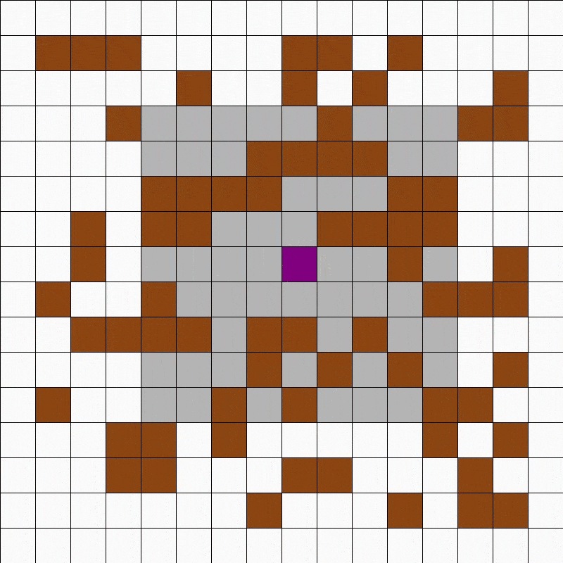

# Self Learning Vacuum Cleaner  
  
Quite literally a virtual self teaching vacuum cleaner agent I made for my AI course assignment.  
Based on Double Deep Q Learning (Deep Reinforcement Learning Algorithm) much like my Deep Q Car project.  

## How it Works
The purple square in the gif is the agent. The brown squares are dust and the grey squares around the agent are its FOV.  
The agent can perceive all dust heaps and walls (borders of the screen) in its FOV.  
The agent's perception is encoded and passed through a Deep Neural Network which outputs the action the agent needs to take.  
The agent Initially starts with no knowledge of the environment and takes completely random actions at the start.  
For each action the agent takes, it receives a reward signal from the environment. This signal is :-
- Positive if the agent scoops up some dust.  
- Negative if it goes out of bounds.
- Zero otherwise.  

The agent saves all of its experiences in memory to consult in the future.  
Every step while training, a batch size amount of experiences are fetched. The DDQL algorithm is applied on these experiences and they are then used to optimize the Neural Network.  
After sufficient iterations, the agent starts exhibiting intelligent behavior.

For an explanation of the Q Learning and Deep Q Learning algorithms, you can refer to [this article](https://towardsdatascience.com/qrash-course-deep-q-networks-from-the-ground-up-1bbda41d3677).

## Can I test it too?
Sure! you need to get some libraries first :-
- Pygame:     `pip install pygame`
- NumPy:      `pip install numpy`
- TensorFlow: `pip install tensorflow==1.15`  
 
Then just run the main.py file. It will tell you how to use it.  
Feel free to play around with the constants in `constants.py`.  
Press the `R` key anytime to start/stop rendering (Not rendering will increase performance).  
Always use the Pygame window's `X` button to exit the program. Using a Keyboard Interrupt will cause your model to not be saved.  

### Side Note
The more astute of you may have noticed that this is just a minimalistic Snake Game AI, and you'd be right!  
Maybe I'll create a Snake AI next.
